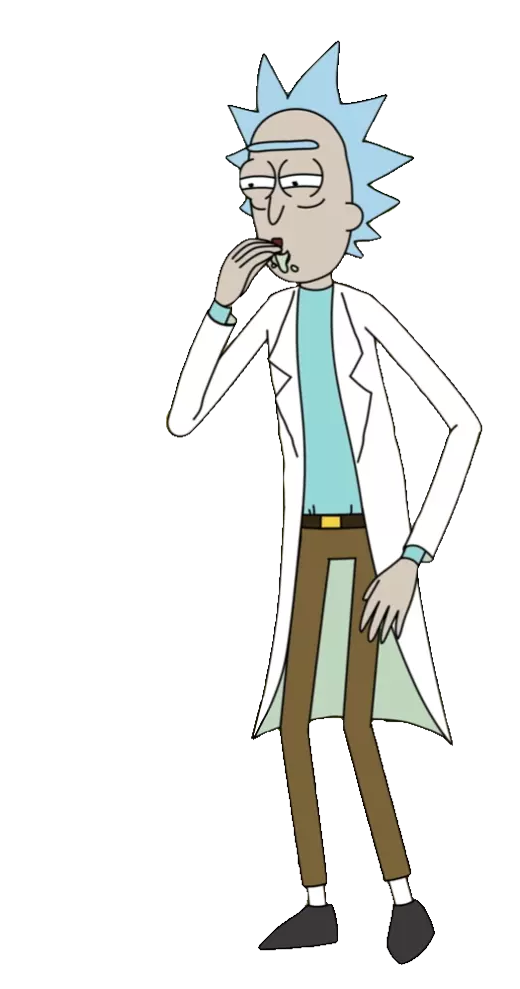

<h1 align="center"> Henrique Santana </h1>

  ## Sobre Mim
  📕Estudante na FATEC Bragança Paulista, cursando Análise e Desenvolvimento  de Sistemas - 4° Semestre. Desenvolvedor Front-end 🖥 e curioso na área de  Segurança da informação 🔐.

  

  
## 🚀 Tecnologias que eu utilizo: 

  
  
  
  
   
  
  

 

 

  <h2 align="center">Contato </h2>
  
  

  

  

